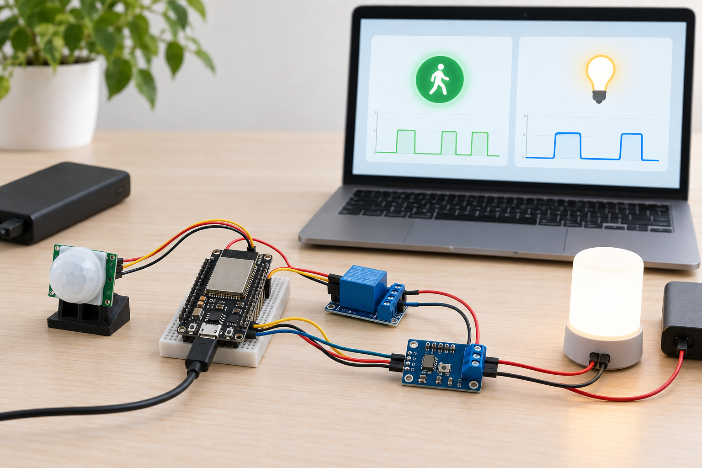
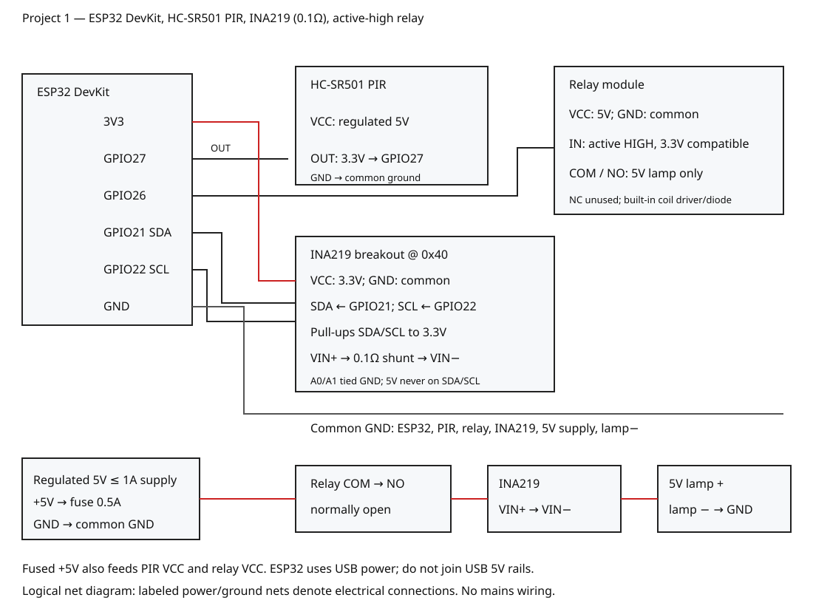

# Room Climate Hub Live Dashboard

Roadmap ID 1 · ESP32 · Wi-Fi · low-voltage educational prototype.

## Overview and objectives

This prototype shows PIR motion, lamp current, sensor health and relay state in a
browser dashboard served by the ESP32. It teaches digital inputs, an I2C current
monitor and explicit actuator fault handling. The roadmap title says “climate”,
but its specified BOM contains no temperature/humidity sensor: this implementation
does not claim to measure climate. Add such a sensor as future work.



**PR completion blocker:** the original illustration was generated, but its
GitHub binary upload was rejected. The path above is pending and this PR must not
be merged until the PNG is committed. The separate SVG below is the wiring authority.

## Features and architecture

- One-second JSON telemetry over USB serial and HTTP.
- Digital PIR input and INA219 current measurement, never analog-reading a relay.
- Password-protected local Wi-Fi access point; no cloud account required.
- Browser controls for a small 5V lamp; OFF on startup, sensor failure or overcurrent.
- Fault recovery requires an explicit new ON command; no automatic restart.

PIR OUT → GPIO27; INA219 → I2C GPIO21/GPIO22 → sampled control state → GPIO26 relay
driver. WebServer exposes the read-only dashboard and POST control endpoint.
The relay is manually commanded; motion is displayed, not used to automatically
energize the lamp. [Architecture](docs/architecture.md).

## Platform and bill of materials

| Quantity | Part | Required specification |
|---|---|---|
| 1 | ESP32 DevKit with ESP32-WROOM | PlatformIO esp32dev target; 3.3V GPIO |
| 1 | HC-SR501 PIR breakout | 5V VCC, measured 3.3V OUT; warm-up required |
| 1 | INA219 breakout | 0.1Ω shunt, address 0x40, 3.3V logic pull-ups |
| 1 | Relay module | Active-high IN accepting 3.3V; built-in coil driver/diode; 5V VCC |
| 1 | 5V LED lamp/load | ≤100mA nominal; never mains |
| 1 | Regulated 5V supply | ≤1A; separate from ESP32 USB power |
| 1 | 0.5A fuse and holder | In external supply +5V branch |
| 1 | USB data cable | Power/flashing ESP32 |
| 1 set | Breadboard and insulated jumpers | Low-voltage prototyping only |
| 2 | 4.7kΩ I2C pull-ups, if absent | SDA/SCL to 3.3V; do not duplicate excessively |

The GPIO does not drive a bare relay coil. An active-low relay module is incompatible
without code and diagram changes. Verify module labels and logic thresholds first.

## Prerequisites and exact pin map

For hardware use: a USB-connected ESP32, PlatformIO Core, Python 3 and a browser.
For cloud validation: Python 3 and g++. This repository can be validated in a cloud
runner; physical assembly/flashing inherently requires access to the actual board.

| ESP32 signal | Connection | Voltage |
|---|---|---|
| GPIO27 | PIR OUT | 3.3V input |
| GPIO26 | Relay IN | 3.3V active HIGH |
| GPIO21 | INA219 SDA | 3.3V I2C |
| GPIO22 | INA219 SCL | 3.3V I2C |
| 3V3 | INA219 VCC and I2C pull-ups | 3.3V |
| GND | All module grounds and external supply negative | Common 0V |
| USB | ESP32 power/data | USB supply; external +5V not joined |

External fused +5V feeds PIR VCC and relay VCC. Lamp circuit:
fused +5V → relay COM → relay NO → INA219 VIN+ → shunt → VIN− → lamp+;
lamp− → external supply GND. NC is unused. INA219 A0/A1 are grounded.

## Circuit, wiring and assembly



The SVG is a logical net diagram; its labeled common power/ground nets are electrical
connections. [Detailed wiring](docs/wiring.md).

1. Disconnect USB and external power. Check polarity, shunt value and relay type.
2. Wire the signal pins above and all grounds. Fit 3.3V I2C pull-ups if needed.
3. Wire the fused 5V load path through COM/NO and VIN+/VIN−; leave NC open.
4. Confirm that no 5V signal reaches GPIO, SDA or SCL. Measure PIR OUT before connecting.
5. Power the ESP32 over USB and modules from the external 5V supply. Keep positive
   supply rails separate; join only grounds. Wait for PIR stabilization.

## Setup, flashing and configuration

```sh
python -m pip install platformio==6.1.18
pio run -e esp32dev
pio run -e esp32dev --target upload --upload-port YOUR_BOARD_PORT
pio device monitor --baud 115200 --port YOUR_BOARD_PORT
```

`platformio.ini` pins espressif32 6.9.0. The board build requires network access to
download that platform/toolchain. It has not been executed in this run. Source lives
in `firmware/room-climate-hub-live-dashboard/`.

Edit `config.h` before hardware use. `demo-only-01` is a public demonstration AP
password, not a personal credential. Use a different ≥8-character password privately;
do not commit credentials. Change current-sensor calibration only after checking
the actual shunt: 4096 assumes 0.1Ω and 100µA/bit. Firmware rejects values outside
−20 to 500mA. This limit is a diagnostic guard, not a certified safety function.

## Usage, telemetry and expected output

Connect to `OpenMaker-Climate-01`, then browse `http://192.168.4.1/`. The dashboard
refreshes once per second. Start with Lamp OFF. Sensor health must be true before ON
is accepted. Wave at the PIR and switch the 5V lamp; confirm motion and current change.

`GET /api/status` returns:

```json
{"project_id":1,"uptime_ms":2000,"motion":true,"current_mA":75.0,"sensor_ok":true,"relay":true}
```

Fields are integer uptime_ms, booleans motion/sensor_ok/relay and current_mA (mA,
one decimal or null on error). [Example](sample-data/dashboard-example.json) is
synthetic, not a physical measurement. USB serial emits the same JSON once per second.

`POST /api/relay?on=1` requests ON; `on=0` requests OFF. Invalid parameters return
400; ON without a valid sensor returns 409. This endpoint has no per-client
authentication beyond the AP password: use only an isolated supervised demo network.

## Tests and results

```sh
python tools/validate.py
python tools/validate_completion.py --allow-pending-image
python tools/validate_completion.py
```

The first checks metadata and required legacy files. The partial validator builds
and executes real C++ control tests covering initial OFF, commands, motion, current
bounds, sensor faults, NaN and fault recovery; it also checks JSON, SVG XML, pin
consistency, relative links, MIT license and basic secret patterns. The default
completion validator additionally requires the real PNG; it is expected to fail
until the rejected image upload is resolved. This explicit partial mode is not a
completion claim. [Recorded validation](docs/validation-results.md).

No physical hardware test, board toolchain build, electrical validation or radio test
has occurred. [Hardware test plan](docs/test-plan.md) lists those required checks.
CI runs full completion validation and the pinned PlatformIO board build, so a PR
with the missing PNG must remain blocked.

## Troubleshooting

| Symptom | Check |
|---|---|
| Current null, ON returns 409 | 0x40 address, VCC/GND, 3.3V pull-ups, shunt and I2C wiring |
| Lamp behaves backwards | Wrong active-low relay; disconnect and fit the specified active-high module |
| PIR stays high | Warm-up, delay/sensitivity settings, motion source; measure OUT |
| No AP | Correct ESP32 target, power/cable; inspect serial boot messages |
| Relay turns OFF under load | Sensor disconnect, overflow or >500mA reading; inspect load and fuse |
| Build cannot download platform | Cloud runner egress/platform availability; do not treat host tests as a board build |

## Limitations and safety

This monitors motion and DC current, not actual room climate. No cloud storage,
mobile notifications, MQTT or energy accounting is implemented. Current accuracy
depends on shunt tolerance, offsets and calibration. Browser control is not secure
for deployment. Only a fused, isolated, low-voltage 5V lamp is allowed. Never wire
mains, heating, locks or hazardous actuators. Relay and software guards are not
certified interlocks; supervise hardware experiments and disconnect on faults.

## Future work, contributing and license

Add BME280 measurements, authenticated control, measured current calibration and
hardware-in-the-loop tests. Contributions must keep firmware, pin map and editable
SVG synchronized, include tests and avoid credential commits. Run full validation
before opening a PR. Distributed under the [MIT license](LICENSE).

Primary references: [TI INA219 datasheet](https://www.ti.com/lit/ds/symlink/ina219.pdf)
and [Espressif Arduino GPIO/I2C mapping](https://docs.espressif.com/projects/arduino-esp32/en/latest/tutorials/io_mux.html).
